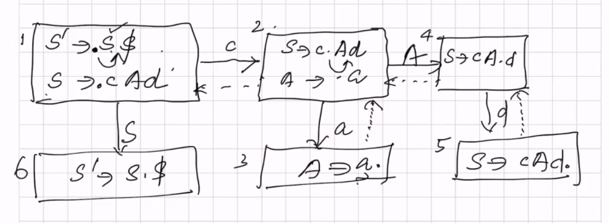
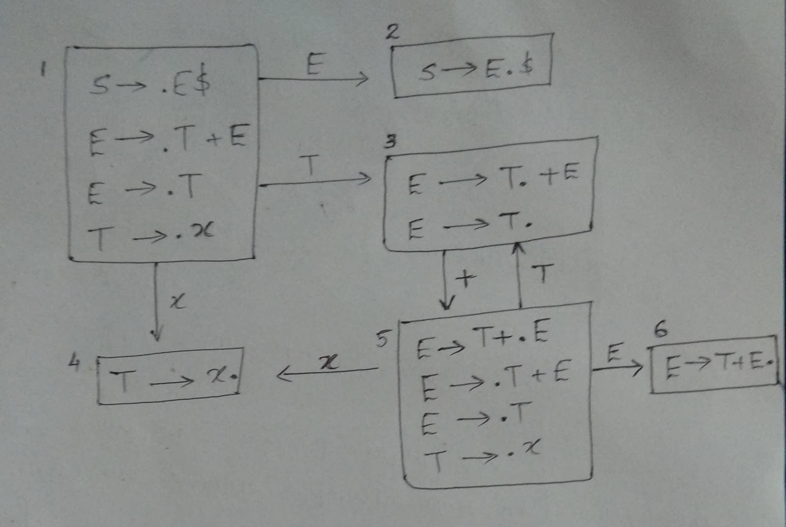
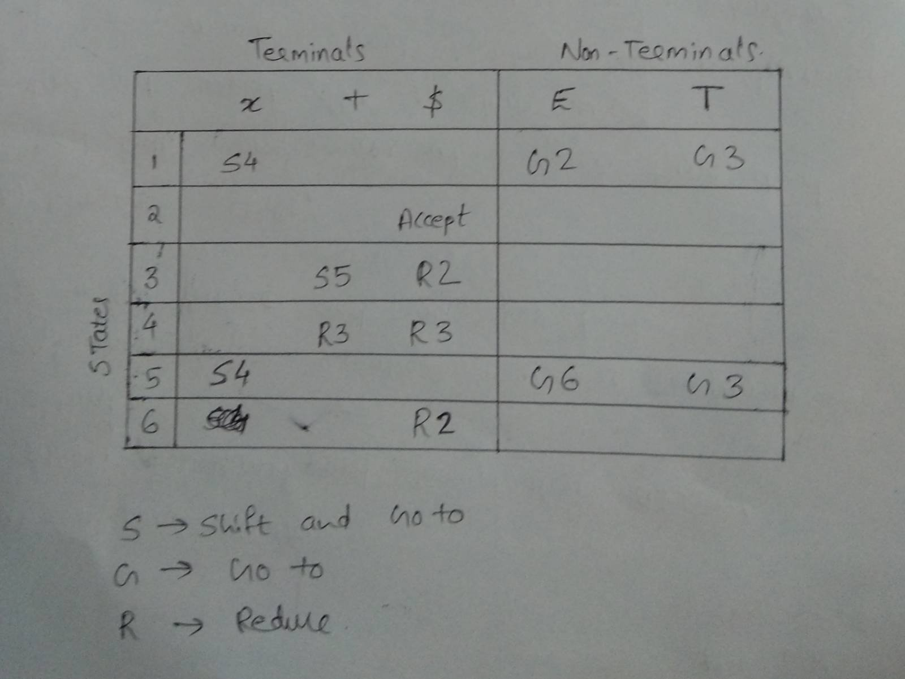
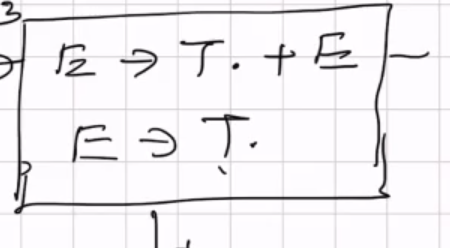

# Bottom-Up Parser

## LR\(0\)

\(0\) means no lookahead.

Shift input symbol to stack  
If possible Reduce  
Repeat


Will have problems if wrong prodcution is reduced \(Multiple production for same non-terminal\). Solved using lookaheads.


> **Grammar**  
> S' → S$  
> S → cAd  
> A → a

### DFA

## SLR

> **Grammar**  
> S → E$  
> E → T + E  
> E → T  
> T → x

> First\(E\) = {x}           Follow\(E\) = {$}  
> First\(T\) = {x}           Follow\(T\) = {+, $}

In case of shift reduce conflict,   
Reduce if next symbol in input is inside the Follow\(\) of production.  
Otherwise Shift.

#### Example

Reduce if next symbol in input is in Follow\(E\), otherwise shift.

## LR\(1\)


Reduce Follow Set to be more precise, and by this we can reduce Shift-Reduce Conflicts.

We are computing lookaheads too in each state. Instead of checking next\_symbol with Follow set, compare with the lookahead.


## LALR


Less powerful than LR\(1\)  
States are merged, but information will be lost. This is done because LR\(1\) has a lot of states.  
Production compilers go for LALR.


