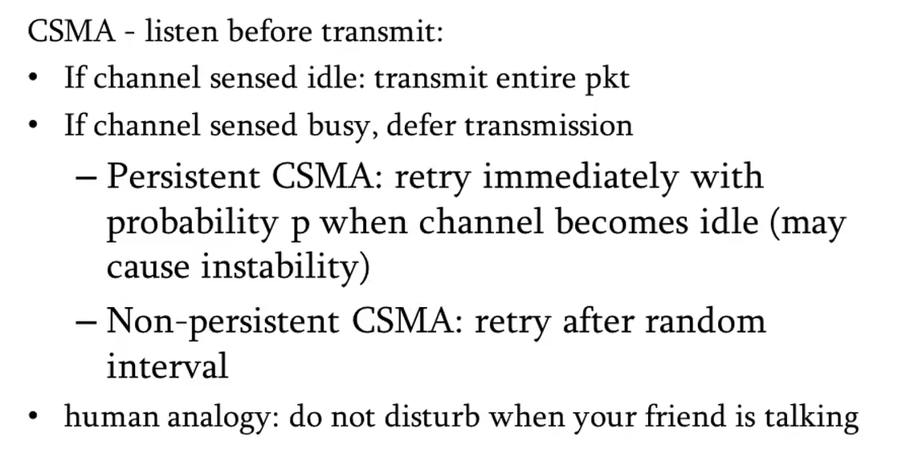

# Data Link Layer

**PDU -** Frame

### Sub-divided into

* Logical Link Control \(LLC\)
* Medium Access Control \(MAC\)

### Services

* Unacknowledged Connectionless \(UC\)
* Acknowledged Connectionless \(AC\)
* Acknowledged Connection Oriented \(ACO\)

> Acknowledged - Acknowledge that the frame is successfully received in the other side  
> Connectionless - No persisting connection


**LAN - UC**  
LAN is connection between 2-way switches and Bit Error Rate \(BER\) is low. 

**WLAN - AC**  
WLAN is wireless, BER is high. So need to acknowledge.

**WAN - ACO**  
WAN BER is low, but have to pass to other layers. In LAN its just forwarding, so no connection to upper layers. Therefore need to keep a active connection and verify frames.


### Functions of DLL

* [Framing](data-link-layer.md#framing)
  * Identify boundaries of frames
* [Addressing](data-link-layer.md#addressing-link-layer-address)
  * MAC addressing
* [Error Control](data-link-layer.md#error-control)
  * Check if frame is corrupted before passing to Network Layer
* [Flow Control](data-link-layer.md#flow-control)
  * Techniques used to control data flow when there is bandwidth differnece between sender and receiver
* [Medium Access Control](data-link-layer.md#medium-access-control)
  * Decides who is going to access the shared medium when congestion or collision occurs

## Logical Link Control

### Framing

* **Time Gap** 
  * Receive each frame with a time gap. Not practically possible. 
* **Character Count**
  * Character count of frame at start of each frame. If error is there, all data will be corrupted. 
* **Byte Stuffing**
  * Specify a start symbol and end symbol at the start and end of frame. Problem occurs if data contains the start symbol or end symbol. Can be solved by having a delimited before using the start symbol in data. 
* **Bit Stuffing**
  * Before start of frame add flag \(01111110\). If 5 consecutive 1's appear in data add 0 after that, to prevent flag appearing in the data. 

### Addressing \(Link Layer Address\)

Called as **MAC/Physical Address.**  
Size is **48 bits.**  
First 24 bits - **Organization Unique Identifier** \(Assigned by IEEE to company\)  
Last 24 bits - **Organization Assigned Portion** \(Company assign to device\)  
1st bit 0 - **Unicast**  
1st bit 1 - **Multicast**


Lecture 3 and 4


### **Error Control**

* **Error Detection**
  * **Cyclic Redundancy Check\(CRC\) or Polynomial Code**
    * **Hardware Implementation \(faster\)**
    * **Implemented in Data Link Layer**
  * **Checksum**
    * **Software Implementaion**
    * **Implemented in Transport Layer**
* \*\*\*\*[**Error Correction**](data-link-layer.md#error-correction)\*\*\*\*
  * **Hamming Code**

### **Hamming Code Equation**


m = number of data bits  
r = number of check bits \(redundant bits\)  
n = m + r = total size


$$
m + r + 1 \leq 2^r
$$

### **Cyclic Redundancy check**

Add additional data \(Frame check sequence\) to the transmitted data. Addtional data is the remainder when transmitted data is divided by \(XOR\) using a generator \(divisor polynomial\). 

Additional data size = degree of generator polynomial


Lecture 5


### Flow Control



Send one frame and wait till we get ack, not used nowadays because this is a waste of bandwidth. If failed to receive ack after certain amount of time, resend the frame.

Good for noiseless channel.



Send multiple frames and move the window whenever an ack is received. If failed to receive ack after certain amount of time, resend the frame.

#### Ethernet

* Half Duplex
  * Using backoff mechanism 
* Full Duplex
  * Flow control is optional
  * Uses auto negotiation
  * There is a **PAUSE Frame**
    * Pause Time header, 100ms means sender needs to wait for 100ms before next transfer. If its 0, sender can send immediately
  * 2 Channels are there for transmission
    * One for sending data to receiver \(Data Channel\)
    * One for receiving Acknowledgement \(Control Channel\)
    * Sending data througn control channel is called as **Piggybacking,** since ack packet is only some bits, we can use the control channel to send data too, and its more efficient \(no bandwidth lose\)




Lecture 6


### Error Correction

* **Forward Error Correction**
  * Error is corrected in Receiver itself.
  * Eg: Hamming Code
* **Backward Error Correction**
  * Inform sender that error is occured, sender will resend the packet.
  * Known as ARQ \(Automatic Repeat Request\)
  * 3 types
    * Stop and Wait ARQ
    * Go Back N ARQ
    * Selective Repeat ARQ
  * All ARQ's differ by window size and how they handle lost ack, lost frame and delayed ack



$$
S.W.S = 1\\R.W.S = 1
$$



$$
S.W.S = 2^k - 1\\R.W.S = 1
$$



$$
S.W.S = 2^k /2\\R.W.S = 2^k/2
$$

[Why this formula?](https://stackoverflow.com/questions/3999065/why-is-window-size-less-than-or-equal-to-half-the-sequence-number-in-sr-protocol)



## Medium Access Control


Lecture 7


#### Where?

❌ Centralized  
            - Many drawbacks and not good if no.of users are more  
✔️ Distributed

#### How?

* Synchronously \(Tight Coordination OR Fixed Partition\)
  * Frequency Division Multiple Access \(FDMA\)
  * Time Division Multiple Access \(TDMA\)
* Asynchronously \(Dynamic Partition\)

### Types

* Fixed Partitioning
  * FDMA
  * TDMA
* Random Access
  * Aloha
  * CSMA/CD
* Reservation

#### FDMA/TDMA

Fixed frequency/time slots are assigned to different users on the channel. Possibility of wastage since some users might not use the alloted space. Good to use when there is less number of users.  
Example: FM radio station

#### ALOHA

Send the packet whenever the frames becomes available. Retransmit if collision occurs.  
Collision might occur from previous time slot or current time slot.  
Max. Efficiency = 0.184

#### Slotted ALOHA

There are time slots. Frame can be send at the start of any time slot. Retransmit if collision occured.  
Since collision can only occur in current time slot, efficiency is doubled.  
Max. Efficiency = 0.368

#### Carrier Sense Multiple Access

